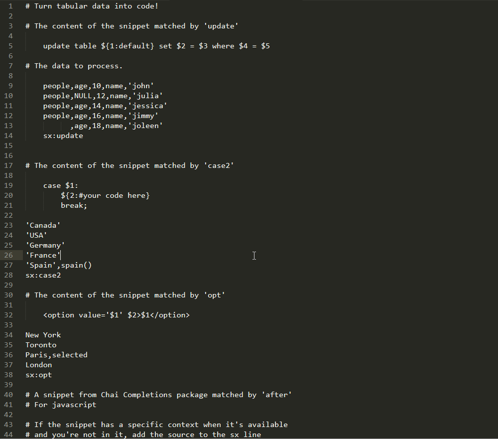

xSnip
============

Like xarg. Substitute rows of data into Snippet placeholders.

## Installation

Download it useing Package Control.

## Usage

place comma-seperated values in your view. At the bottom or top add 'sx:' followed by the name of the snippet you'd like to use. Make sure there are spaces at the bottom or top. Hit Alt+x. 

## License

MIT © [Colin Ryan](http://github.com/ColinRyan)